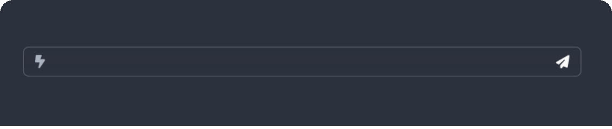

# emems



<p align="center">


<br />


</p>

------

## What is emems?

**emems** is a short & sweet web app that allows users to create and manage memo objects. Create, view, and delete memos from the web GUI or the API.

Each memo is a *rendered element*, so the possibilities are endless; the only limit is your imagination and probably some techinical limitations that I'm not aware of yet.

### Features

- REST API
- Web UI
- Docker Deployment

### Requirements

**emems** is deployed using Docker.

- Docker &mdash; [Install Help](https://docs.docker.com/engine/install/)
- Docker Compose (optional) &mdash; [Install Help](https://docs.docker.com/compose/#docker-compose)

### Getting Started

To install emems, you can either build it locally or use the pre-built Docker image.

#### Pre-Built Docker Image
##### Docker Compose (Recommended)

The recommended method of installing is to use docker compose. You can use the provided `compose.yaml` file, or add a service on your existing file.

This will create a container on port 9000 with the name emems. Feel free to modify the local port as needed.

```
services:
  emems:
    container_name: emems
    ports:
      - "9000:3000"
    restart: always
    image: ghcr.io/dawescc/emems:latest

```

##### Docker CLI

If you're not using compose, you can use the docker cli to run the image. This will create a container on port 9000 with the name emems. Feel free to modify the local port as needed.

```docker run -d --name emems -p 9000:3000 ghcr.io/dawescc/emems:latest```

#### Building Locally

If you want to build the image locally, you can use the provided `Dockerfile`.

```docker build -t emems .```

and then deploy using the docker cli

```docker run -d --name emems -p 9000:3000 emems```

### Usage

Access the web app via `https://localhost:9000`.

emems has a simple REST API that can be used to create, read, and delete memos. The API is accessible at `/api/memos`:

<br>

`POST /api/memos` &mdash; Create a new memo

`GET /api/memos` &mdash; Get all memos

`GET /api/memos/:id` &mdash; Get a specific memo by id &nbsp; 

`DELETE /api/memos/:id` &mdash; Delete a memo


#### Screenshots

```
curl -X POST -H "Content-Type: application/json" -d '{"content":"hi emems!"}' http://localhost:9000/api/memos/
```


```
curl -X GET -H "Content-Type: application/json" http://localhost:9000/api/memos/
```


```
curl -X DELETE -H "Content-Type: application/json" http://localhost:9000/api/memos/1
```

